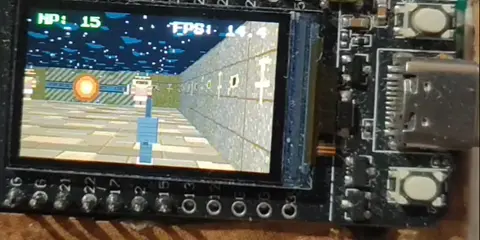
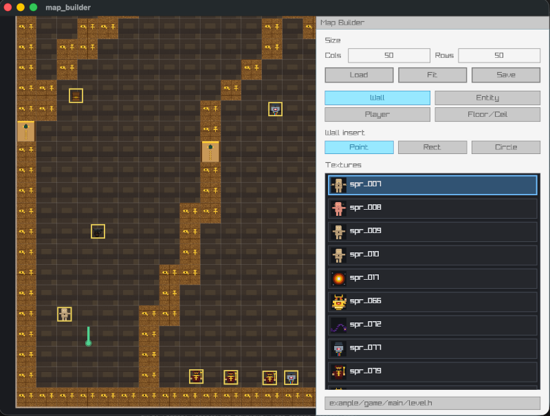
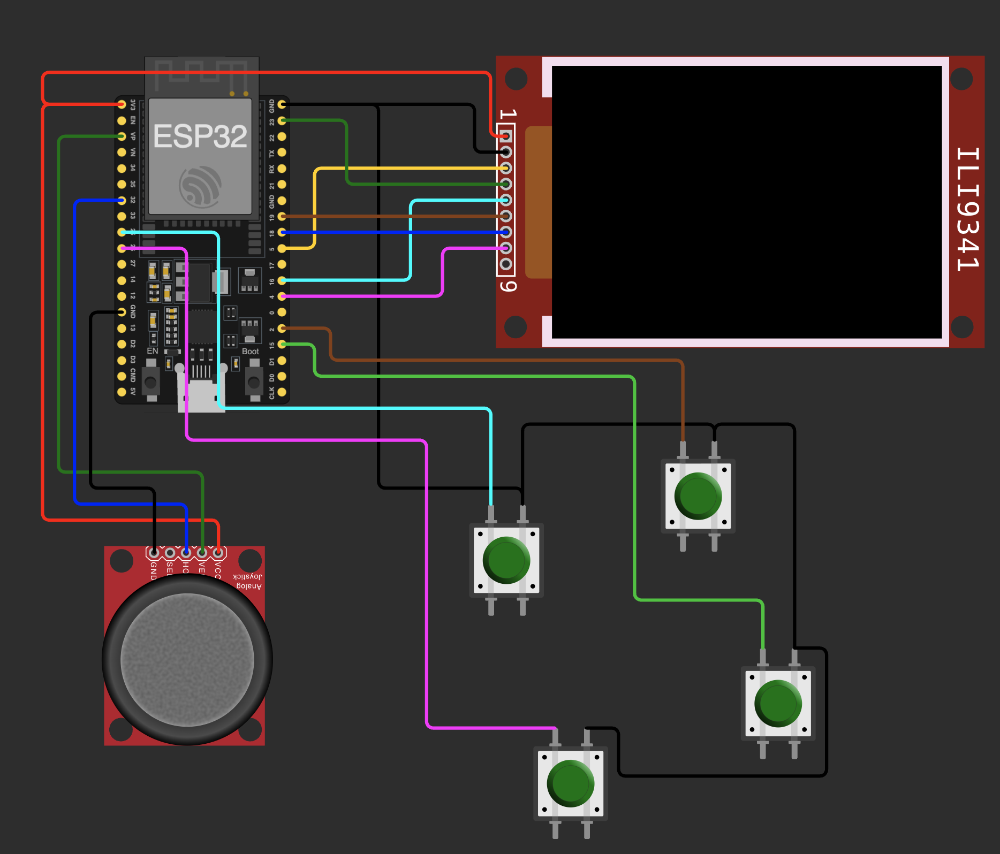

# yari

**Yet Another Raycast Implementation**

A small C game engine for building vintage first-person games in the spirit of
Wolfenstein 3D. YARI is focused on ESP32 hardware, but the same game code also
runs on macOS, Linux and WebAssembly through raylib or SDL2.


[](#) [](#supported-targets) [](#desktop-macoslinux) [](#desktop-macoslinux) [](#webassembly)

**Try the [browser demo](https://monade.github.io/yari)**

[](#)

## Table of Contents

- [What is YARI?](#what-is-yari)
- [Quick Start](#quick-start)
- [Supported Targets](#supported-targets)
- [Project Layout](#project-layout)
- [Writing a Game](#writing-a-game)
- [Core API](#core-api)
- [Maps, Assets and Fonts](#maps-assets-and-fonts)
- [Map Builder](#map-builder)
- [Build Commands](#build-commands)
- [ESP32 Configuration](#esp32-configuration)
- [Compatibility and Current Limits](#compatibility-and-current-limits)
- [Included Examples](#included-examples)
- [Acknowledgements](#acknowledgements)

## What is YARI?

`yari` is a compact raycasting engine for old-school 2.5D games.

It is not a general-purpose game engine. The goal is to stay small,
understandable and practical on constrained hardware, while keeping desktop
development fast enough to iterate without flashing an ESP32 after every
change.

The repository includes:

- the engine core in `src/yari`;
- renderer and input backends for ESP32, raylib and SDL2;
- desktop, web and ESP-IDF examples;
- tools that convert images and fonts into C headers;
- a visual level editor that generates YARI-compatible `level.h` files.

## Highlights

- **C raycasting renderer**: column-based wall rendering, sprite z-buffering,
  distance shading and floor/ceiling casting.
- **ESP32-first design**: ST7789 SPI backend, RGB565 framebuffer, configurable
  LCD pins and ready-to-build ESP-IDF examples.
- **Desktop iteration**: the same game can run on macOS/Linux through raylib or
  SDL2, which makes development and debugging much faster.
- **Web output**: the full game example can be compiled to WebAssembly and run in a browser.
- **Static assets**: textures and fonts are packed into C arrays, making them
  easy to ship inside embedded firmware.
- **Built-in map editor**: `map_builder` generates map data, player settings,
  surfaces, entities, collision layers and reloadable editor metadata.
- **Small game-facing API**: a game implements `yr_init_game()` and
  `yr_update_game()`. YARI owns the platform loop, rendering setup and input
  setup.

## Quick Start

### ESP32

Requirements:

- ESP-IDF installed and configured;
- a connected ESP32 board;
- an ST7789 display matching the default pin configuration, or custom LCD/pin
  macros supplied at build time.

The project has been developed with ESP-IDF 5.5.2.

```sh
make esp32-build
make esp32-flash-monitor
```

If ESP-IDF is not installed under the path used by the `Makefile`, pass
`ESP32_HOME` explicitly:

```sh
make ESP32_HOME="$HOME/esp/v5.5.2/esp-idf" esp32-build
```

### Desktop macOS/Linux

Requirements:

- a C compiler;
- `make`;
- `pkg-config`;
- raylib and/or SDL2 available through `pkg-config`.

For the default raylib backend on macOS with Homebrew:

```sh
brew install raylib
make run
```

For the SDL2 backend on macOS with Homebrew:

```sh
brew install sdl2
make run-sdl
```

On Linux, install the raylib or SDL2 development package with your
distribution's package manager, then run one of:

```sh
make run
make run-sdl
```

`make run` builds the raylib backend. `make run-sdl` builds the SDL2 backend.
Both start the complete example in `example/fps/main/main.c`.

### WebAssembly

Requirements:

- Emscripten active in the shell (`emcc` and `emar` in `PATH`);
- `npx` if you want to serve locally.

```sh
make wasm
make run-wasm
```

The web build writes `docs/index.html`, `docs/index.js` and `docs/index.wasm`.

## Supported Targets

| Target | Backend | Status |
| --- | --- | --- |
| ESP32 | ST7789 renderer + GPIO/ADC input | supported |
| macOS | raylib or SDL2 | supported |
| Linux | raylib or SDL2 | supported |
| WebAssembly | raylib PLATFORM_WEB + Emscripten | supported |
| Windows | potentially raylib or SDL2 | no build scripts are provided yet |

## Project Layout

```text
.
├── example/                 # Example games
├── src/
│   ├── tools/               # assets_packer, font_baker, map_builder
│   └── yari/                # Engine source
│       ├── platform/esp32/  # ESP32 backend
│       ├── platform/raylib/ # Desktop/web backend
│       └── platform/sdl/    # Desktop SDL2 backend
└── Makefile                 # Desktop, WASM, ESP32 and tool builds
```

## Writing a Game

A YARI game includes `yari.h`, defines `YARI_MAIN` and implements two
functions:

```c
#define YARI_MAIN
// #define YARI_NO_PREFIX
#include <yari.h>

...

void yr_init_game(YrGameState *state) {
    // configure the game state
    state->map = (uint8_t *)map;
    state->map_cols = 20;
    state->map_rows = 20;
    state->camera = (YrCamera){.pos = {14.5, 5.5}, .dir = {-0.8, 0.5}};
}

void yr_update_game(YrGameState *state) {
    // update the game state and draw the frame
    yr_draw_game(state);
}
```

Youc can find a minimal example in `example/base/main.c`:


`YARI_NO_PREFIX` is optional. Without it, use the explicit `yr_` and `Yr`
symbols, such as `yr_draw_game()` and `YrGameState`.

## Core API

### Game State

`YrGameState` is the central structure used by the engine.

| Field | Purpose |
| --- | --- |
| `camera` | camera position, direction, offset and rotation |
| `screen_width`, `screen_height` | framebuffer resolution |
| `game_title` | desktop window title |
| `target_fps` | target frame rate, zero for unlimited |
| `map`, `map_cols`, `map_rows` | tile map stored as `uint8_t` cells |
| `entities` | dynamic array of sprites/objects |
| `ray_res` | pixel width of each cast ray; larger values are faster but blockier |
| `zbuffer` | internal wall-depth buffer allocated by YARI |
| `assets_map` | texture lookup table generated by `assets_packer` |
| `floor_texture`, `ceil_texture` | floor and ceiling texture ids, or `0` for black |
| `game_time` | milliseconds since game start |
| `game_data` | user-defined pointer for custom game state |

### Rendering

| Function | Description |
| --- | --- |
| `yr_draw_game()` | draws background, walls and entities using the global state |
| `yr_draw_background(state)` | draws floor and ceiling |
| `yr_draw_walls(state)` | raycasts and draws walls |
| `yr_draw_entities(state)` | updates, sorts and draws entities |
| `yr_draw_text(text, x, y, font, color)` | draws bitmap text |
| `yr_draw_texture(x, y, width, height, texture, texture_width, texture_height, skip_empty)` | draws a scaled 2D texture, useful for HUD and UI elements |
| `yr_clear_screen(color)` | fills the framebuffer |
| `yr_draw_rectangle(x, y, w, h, color)` | low-level renderer primitive |
| `yr_get_frame_time()` | frame delta time in seconds |
| `yr_get_time()` | platform time in seconds |
| `yr_get_fps()` | current FPS estimate |

The raycaster assumes `64x64` textures for walls, floors, ceilings and
entities (`YR_TEXTURE_SIZE`). HUD textures can be drawn with `yr_draw_texture()`
by passing the correct source stride.

### Physics and Collisions

| Function | Description |
| --- | --- |
| `yr_move(pos, dir, movement, speed)` | moves a point using delta time |
| `yr_rotate(vector, rotation, speed)` | rotates a vector using delta time |
| `yr_check_collision(state, pos, radius, mask)` | checks collisions against walls and entities |
| `yr_check_ray_collision(state, origin, dir, dist, mask)` | checks collisions along a ray |
| `yr_slide_collision(state, from, to, hit, radius, mask)` | moves while sliding along obstacles |

Built-in collision masks:

```c
#define YR_CMSK_NONE 0
#define YR_CMSK_WALL 1
#define YR_CMSK_ALL  -1
```

Entities can use custom bit masks for collision layers. The map builder can
define custom layers and generate macros such as `YR_CMSK_ENTITY`, `YR_CMSK_PLAYER`...

### Input

| Function | Desktop raylib/SDL2 and web raylib | ESP32 |
| --- | --- | --- |
| `yr_is_key_down(key)` | reads the platform keyboard | reads a registered GPIO |
| `yr_is_key_up(key)` | reads the platform keyboard | reads a registered GPIO |
| `yr_is_key_pressed(key)` | platform edge press | GPIO edge press |
| `yr_esp_key_init(pin, key)` | no-op | maps a pull-up GPIO to a YARI key |
| `yr_joystick_init(pin_x, pin_y)` | stub | registers two ADC pins |
| `yr_joystick_get_axis(id, axis)` | returns `0` | returns an axis around `-1..1` |

Key codes are defined in `src/yari/inputs.h` and follow raylib values. The SDL2
backend maps SDL key events into the same YARI key enum, so game code can be
shared across desktop backends and embedded targets.

### Entities

`YrEntity` represents a sprite in the world.

| Field | Purpose |
| --- | --- |
| `pos` | position in map space |
| `texture_id` | index inside `assets_map` |
| `dist` | distance from the player, maintained by the renderer |
| `vdiv`, `hdiv` | vertical/horizontal sprite size reduction |
| `vmove` | perspective vertical offset |
| `disabled` | if `true`, the entity is skipped |
| `entity_data` | user-defined pointer |
| `collision_mask` | entity collision layer |
| `collision_threshold` | collision radius |
| `update` | callback invoked every frame |

To add or remove entities, use the dynamic array macros from `da.h`:

```c
yr_da_append(&state->entities, entity);
yr_da_remove_unordered(&state->entities, index);
yr_da_free(&state->entities);
```

## Maps, Assets and Fonts

### Map Format

The map is a linear `uint8_t` array with `map_rows * map_cols` cells.

| Cell value | Meaning |
| --- | --- |
| `0` | empty space |
| `1..127` | texture id, indexed through `assets_map` |
| `128..255` | solid color, indexed as `yr_color_map[tile - 128]` |

Player and entity coordinates are floating-point values in the same map space.
Cell `(x, y)` covers the area `[x, x+1)`, `[y, y+1)`.

### Image Assets

Source assets are converted into static C arrays by `assets_packer`.

```sh
make assets
# it runs build/assets_packer example/fps/assets example/fps/main/assets.h
```

`assets_packer`:

- reads `.png` and `.jpg` files from the directory passed as the first argument;
- generates one `yr_pixel_t` array per image;
- generates a `TextureId` enum with `tx_<file_name>` symbols;
- generates `assets_map[]`;
- emits both RGB565 data for `COLOR_565` builds and 32-bit data for
  desktop/web builds.
- the output file is written to the path passed as the second argument.

Use simple C-friendly file names, for example `wal_001.png`, `wep_gun0.png` or
`door_metal.png`.

### Fonts

`.ttf` files under `assets/font/` are baked into
`example/fps/main/fonts.h`:

```sh
make assets
# it runs build/font_baker example/fps/assets/font example/fps/main/fonts.h
```

- reads `.ttf` files from the directory passed as the first argument;
- the output file is written to the path passed as the second argument;

`font_baker` generates four font sizes:

- `YR_FONT_SM`;
- `YR_FONT_MD`;
- `YR_FONT_LG`;
- `YR_FONT_XL`.

Example:

```c
yr_draw_text("HP: 100", 10, 15, fonts[YR_FONT_SM], YR_GREEN);
```

## Map Builder

[](#)

YARI includes a raylib/raygui visual level editor:

```sh
make edit-fps
make edit-kart
```

To build the editor without launching it:

```sh
make map-builder
```

`make edit-fps` builds the tool and runs:

```sh
build/map_builder assets example/fps/main/level.h
```

The executable accepts optional paths:

```sh
build/map_builder [assets_dir] [output_file]
```

If omitted, `assets_dir` defaults to `assets` and `output_file` defaults to
`level.h`. The asset directory is scanned for `.png`, `.jpg` and `.jpeg` files;
their names are converted to the same `tx_<file_name>` symbols generated by
`assets_packer`, so run `make assets` after adding or renaming textures.

On startup, the editor tries to load the `MAP_BUILDER_STATE_BEGIN/END` metadata
from the output file. Press `Save` to overwrite the output header and `Load` to
reload the last saved state.

The generated file contains:

- map dimensions (`YR_MAP_COLS`, `YR_MAP_ROWS`);
- wall grid data;
- floor and ceiling texture ids;
- player position, direction and collision radius;
- custom collision layers;
- inline factories for entities;
- `level_append_exported_entities()`; // appends entities marked as `exported` in the editor to the game state
- `level_get_map()`;
- a commented `MAP_BUILDER_STATE_BEGIN/END` block used to reload the level in
  the editor.

Include the generated header from game code and wire it into `yr_init_game()`:

```c
#include "assets.h" // generated by assets_packer
#include "level.h" // generated by map_builder

void yr_init_game(GameState *state) {
    load_level(state);
    // ...
}
```

Entities marked as `exported` in the editor are appended in the game state entities.
If you want to spawn entities at runtime you can remove the `exported` flag and call the factory functions directly, for example:

```c
YrEntity enemy = create_enemy_pos((Vector2){10.0f, 5.0f}, NULL);
yr_da_append(&state->entities, enemy);
```

Entities with a named update callback generate a forward declaration for that function, so implement it in game code
with this signature:

```c
void update_enemy(YrGameState *state, YrEntity *self, size_t index) {
    (void)state;
    (void)self;
    (void)index;
}
```

Useful map builder controls:

| Action | Control |
| --- | --- |
| save | `Save` button or `Ctrl/Cmd+S` |
| reload level | `Load` button |
| fit view | `Fit` button |
| copy selection | `Ctrl/Cmd+C` |
| paste selection | `Ctrl/Cmd+V` |
| delete selection | `Delete` or `Backspace` |
| pan | middle mouse button, or `Space` + left drag |
| zoom | mouse wheel with `Ctrl/Cmd` |

Main editor modes:

- `Wall`: draw walls as points, rectangles or circles.
- `Entity`: place sprites with texture, update callback, collision mask.
- `Player`: edit player position, direction, collision radius and collision layers.
- `Floor/Ceil`: assign floor and ceiling textures.

## Build Commands

| Command | Effect |
| --- | --- |
| `make run` | builds and runs `example/fps` with raylib on desktop |
| `make run-sdl` | builds and runs `example/fps` with SDL2 on desktop |
| `make run-base` | builds and runs the minimal example |
| `make assets` | regenerates `assets.h` and `fonts.h` |
| `make edit-fps` | builds and runs the map editor for `example/fps` |
| `make edit-kart` | builds and runs the map editor for `example/kart` |
| `make run-wasm` | builds and serves the WebAssembly `example/fps` |
| `make esp32-build` | builds `example/fps` with ESP-IDF |
| `make esp32-flash` | builds and flashes `example/fps` |
| `make esp32-monitor` | opens the serial monitor |
| `make esp32-flash-monitor` | flashes and opens the serial monitor |
| `make esp32-clean` | runs `idf.py fullclean` in `example/fps` |
| `make esp32-base-build` | builds `example/base` for ESP32 |
| `make esp32-base-flash-monitor` | flashes and monitors the base example |

`make all` builds desktop, WebAssembly and ESP32 targets. For day-to-day work,
use narrower targets such as `make run` or `make esp32-flash`.

## ESP32 Configuration

The ESP32 backend is implemented in `src/yari/platform/esp32/renderer.c` and
targets an ST7789 display over SPI in landscape orientation.

Main configuration macros:

```c
// Framebuffer
// Display
#define LCD_W 240
#define LCD_H 136
#define LCD_X_OFF 40
#define LCD_Y_OFF 53

// ST7789 pins
#define PIN_MOSI 19
#define PIN_CLK 18
#define PIN_CS 5
#define PIN_DC 16
#define PIN_RST 23
#define PIN_BL 4

// SPI
#define SPI_CLOCK_SPEED (80 * 1000 * 1000)
```

The ESP-IDF examples already add:

```cmake
idf_build_set_property(COMPILE_OPTIONS "-DESP32" APPEND)
idf_build_set_property(COMPILE_OPTIONS "-DCOLOR_565" APPEND)
```

To use YARI as an ESP-IDF component in another project:

```cmake
set(EXTRA_COMPONENT_DIRS "/path/to/yari/src/yari")
include($ENV{IDF_PATH}/tools/cmake/project.cmake)
```

Then require `yari` from your `main` component:

```cmake
idf_component_register(
    SRCS "main.c"
    REQUIRES yari
)
```

### ESP32 Input

Digital buttons are configured as pull-up GPIOs:

```c
esp_key_init(25, YR_KEY_Q);
esp_key_init(2, YR_KEY_E);
esp_key_init(15, YR_KEY_X);
esp_key_init(26, YR_KEY_SPACE);
```

The analog joystick uses two ADC pins:

```c
int joystick_id = joystick_init(32, 36);
float x = joystick_get_axis(joystick_id, YR_X_AXIS);
float y = joystick_get_axis(joystick_id, YR_Y_AXIS);
```

### ESP32 Example diagram
[](#)
[Wokwi diagram](https://wokwi.com/projects/468287699711870977)

## Compatibility and Current Limits

- The project is plain C.
- The ESP32 renderer currently targets ST7789 SPI displays with an RGB565 framebuffer.
- Desktop rendering can use raylib or SDL2; web rendering uses raylib.
- Windows is not currently covered by dedicated build scripts.
- Raycaster textures are expected to be `64x64`.
- Map cells are `uint8_t`: textured walls must use values `1..127`, because
  `128..255` is reserved for solid colors.
- Desktop joystick backends are currently stubs.

## Included Examples

### `example/base`

A minimal example with an in-memory map and solid-color walls. Use it to learn
the engine contract without the asset pipeline.

```sh
make run-base
```

### `example/fps` and `example/kart`

Two complete examples with:

- packed assets from `assets/`;
- bitmap fonts;
- a level generated by the map builder;
- player movement;
- HUD rendering;
- a weapon pickup;
- desktop, ESP32 and WebAssembly builds.


```sh
# fps
make esp32-flash
make run
make run-sdl
make run-wasm

# kart
make esp32-kart-flash
make run-kart
make run-sdl-kart

```

## Acknowledgements

- [lodev](https://lodev.org/cgtutor/raycasting.html) raycasting tutorial
- [raylib](https://github.com/raysan5/raylib) used for the desktop and web backends